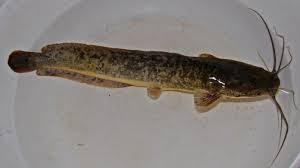

# African Catfish: Is it a Real Threat in Nepal?

- _Achyut Babu Acharya_
- _B.VSc. & A.H_
- _V Semester_
- _Nepal Polytechnic Institute, Bharatpur Nepal_

## Introduction

African catfish, known as _Clarias gariepinus_ of Claridae family, is a carnivorous fish with a grey-black appearance, commonly referred to as 'Mangur' in the local Nepali language. This fish is characterized by its air-breathing capability, earning it the name sharptooth catfish.

## History of African Catfish Farming

African Catfish, native to Africa and the Middle East, was introduced for aquaculture purposes in Brazil, Vietnam, Indonesia, and India in the 1980s. In Nepal, it was introduced in 1996-97 by fry traders from India and Bangladesh.

## Morphology

- **Color:** Grey, brown to black
- **Size:** Average length of 50-70 cm, record weight up to 60 kg
- **Habitat:** Freshwater rivers, lakes, and swamps
- **Behavior:** Nocturnal, bottom-dwelling, air-breathing

## Rearing of Catfish

Catfish rearing is flourishing, with the ability to thrive in earthen ponds, cemented ponds, and bioflocs. The fish is hardy and can tolerate various conditions, with an optimum temperature range of 20-30°C. Rearing in Nepal, especially in the Terai region, has uplifted the socio-economic status of farmers.

## Positive Attributes to Farming

Fish farming, particularly African catfish, has economic benefits for farmers and the country. It is cost-effective, with high-density farming resulting in a higher yield. The fish's market potential in Nepal has been growing, and it fetches higher prices than Tilapia.

## Market of African Catfish

Internationally, African catfish has been produced in various countries. In Nepal, the market is primarily local and domestic, lacking proper infrastructure and facilities. Despite this, the market is growing, with around 2500 metric tons of African catfish produced yearly.

## Benefits for Consumers

The meat of African catfish is rich in high-grade proteins, essential amino acids, minerals, and vitamins. It contains mono and poly-saturated fatty acids, including omega-3 and omega-6 fatty acids, making it a valuable food product.

## Health Concerns

In Nepal, catfish is sometimes fed with slaughterhouse wastage containing traces of lead. However, the Tolerable Daily Intake (TDI) of lead is below the acceptable limit, indicating that it poses a lower health risk and is consumable.

## Threat of African Catfish in Nepal

The rapid growth and reproduction of African catfish pose a threat to local ecosystems, especially during flooding when ponds overflow, allowing the fish to reach rivers. There is concern about hybridization with local breeds and its impact on the gene pool.

## Banning of African Catfish in Nepal

As of now, there is no legal ban on African catfish in Nepal. In India, the High Court has implemented a ban nationwide due to potential threats to indigenous fish and aquaculture diversities.

## Is it Necessary to Ban in Nepal?

The author argues that if farming is done sustainably, maintaining ecological balance, African catfish farming can benefit Nepali farmers. Government policies should focus on modern and eco-friendly farming practices.

## References

- Shukla Gandaki Agriculture Production and Research Pvt. Ltd
- Lamgadi Krishi Farm Pvt. Ltd
- The introduction of the African catfish _Clarias gariepinus_ (Burchell, 1822) into Brazilian inland waters: a growing threat
- African Catfish: A boon or bane for the environment: A critical analysis
- An Appraisal of Introduced African Catfish _Clarias gariepinus_ (Burchell, 1822) in India: Invasion and Risks
- [Animal Diversity Web - Clarias gariepinus](https://animaldiversity.org/accounts/Clarias_gariepinus/)
- Effects of feed composition on the nutritional value of meat of African Catfish
- Forecast of the nutritional value of catfish (_Clarias gariepinus_) in the spawning period
- FAO Fisheries & Aquaculture - Cultured Aquatic Species Information Programme - Clarias gariepinus (Burchell, 1822)
- Aquaculture Development in Nepal and Current Needs
- M.A. Husen (2019) Int. J. Appl. Sci. Biotechnol. Vol 7(1): 1-5. DOI: 10.3126/ijasbt.v7i1.22938
