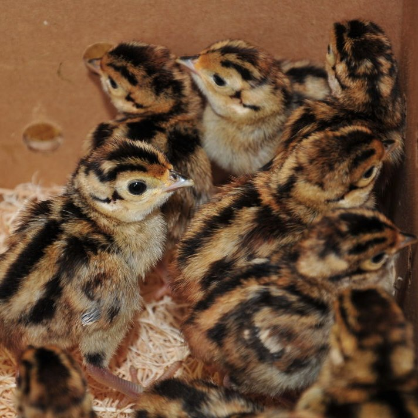
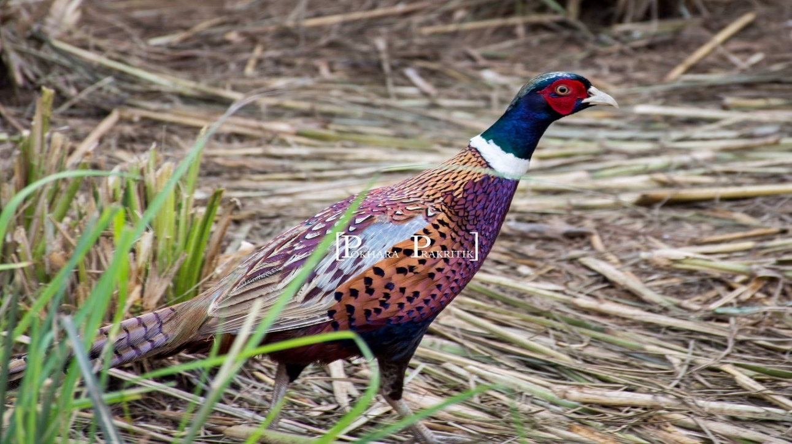

# Pheasant Farming: An Overview and Condition in Nepal

- _Achyut Babu Acharya_
- _General Committee Member IVSA-NPI_
- _III Semester_
- _Nepal Polytechnic Institute_

## Introduction

Pheasants, beautiful wild birds mainly found in South East Asia, have about 51 known varieties globally. In Nepal, notable species include the Blood pheasant, Cheer pheasant, Satyr pheasant, Kalij, Koklass Pheasant, and the Himalayan Monal (Danfe), which is the national bird of Nepal. Hunting and poaching of wild pheasants are illegal, and conservation efforts are mandated by the 'National Park and Wildlife Conservation Act-1973.'

## History of Pheasant Farming

The introduction of pheasants to Europe dates back to around 2000 years ago, brought by Greek people from China. Commercialization began in the 19th century, with the common pheasant imported to Europe in 1768 AD. Pheasants were initially used for gaming and later transported to North America.

## History of Farming in Nepal

Pheasant farming was introduced in Nepal in 2072 BS. Pheasant eggs were brought from Belgium, leading to the establishment of commercial farms across the country. Licensing from the Nepal Government is required for such farms.

## Farming Techniques of Pheasant

### Hatching of Eggs

- Pheasants are seasonal breeders, laying 50-60 eggs per batch from March to July.
- Eggs are collected, stored at 50°F for 24 hours, then shifted to an incubator.
- After 21 days, they are moved to a hatcher for hatching.

<figure class="image">
    
 
  <figcaption style="text-align:center">Day old chicks of Ring neck pheasant</figcaption>
  <figcaption style="text-align:center">Source: Pokhara Prakritik Krishi Utpadan Pvt. Ltd.</figcaption>
</figure>

### Brooding of Chicks

- Day-old chicks are kept in small groups with a temperature of 95-100°F.
- Chicks are given feed with 25% crude protein.
- Adequate space is crucial to avoid issues like feather picking and cannibalism.

### Management of Adult Birds

- Up to 8 weeks, pheasants are kept inside sheds; afterward, they are moved to open pens.
- Pens are constructed with iron wire netting, and proper space per bird is maintained.
- Sexual dimorphism is observed, with males being larger and more colorful.

<figure class="image">
    
 
  <figcaption style="text-align:center">Male Ring Neck Pheasant</figcaption>
  <figcaption style="text-align:center">Source: Pokhara Prakritik Krishi Utpadan Pvt. Ltd.</figcaption>
</figure>

## Present Condition of Pheasant Farming in Nepal

In Nepal, Ring Neck pheasants and Melanistic Mutant pheasants are primarily reared. The total population is around 10,000-15,000 in 2019-2020AD, projected to increase to 40,000-50,000 next year. Pheasant meat, high in protein and low in fat, has a growing market in hotels and restaurants. Despite being widely used as game birds in Europe and North America, such activities are not feasible in Nepal. However, there is potential for meat products and feathers in the garment industry. Government support through subsidies and insurance policies can encourage pheasant farming as a promising platform alongside the poultry market in Nepal.

## References

- Pokhara Prakritik Krishi Utpadan Pvt. Ltd. (Pokhara-33)
- Nepal Wild Food Product Pvt. Ltd. (Pokhara-33)
- [The History of the Pheasant](https://www.thefield.co.uk/shooting/the-history-of-the-pheasant-22364)
- _The History of Pheasants:_ Michael Yardley, 2015
- [Raising Pheasants - NDSU Extension](https://www.ag.ndsu.edu/publications/environment-natural-resources/raising-pheasants)
- McFarlane Pheasant Inc., _Rearing Guide_
- IUCN Status Survey and Conservation Action Plan 2000-2004 of Pheasant, Edited by Richard A. Fuller and Peter J.
- [The Rising Nepal - Pheasant Farming](https://therisingnepal.org.np/news/32384)
